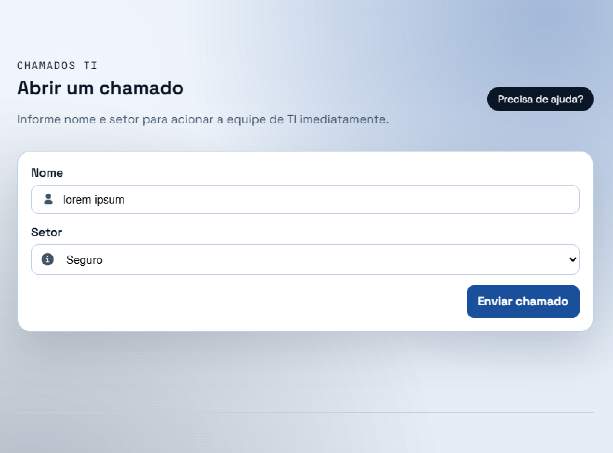
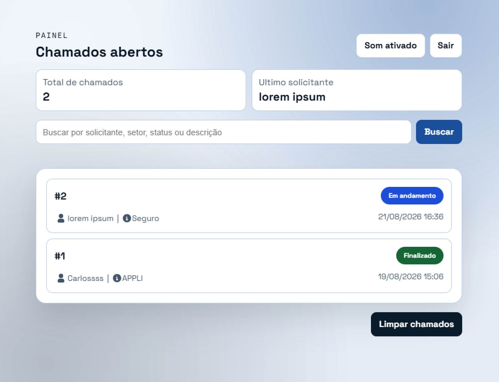
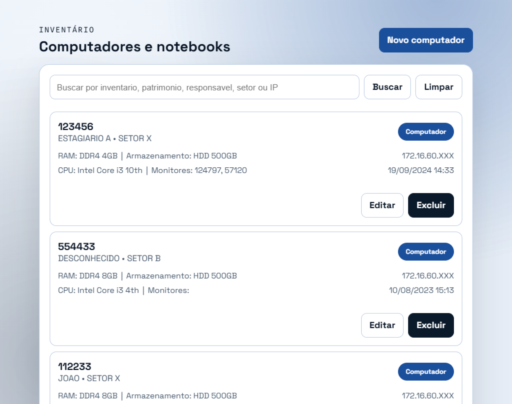
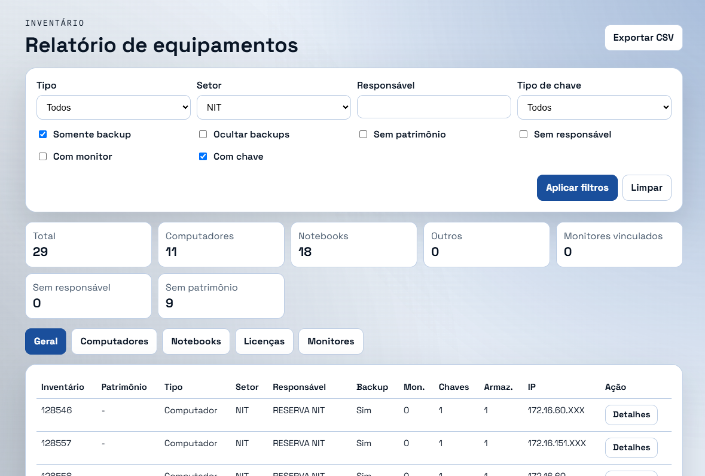

<div align="center">

# Chamados TI

[Como Rodar](#como-rodar) • [Funcionalidades](#funcionalidades) • [Deploy](#atualizar-em-produção) • [Tecnologias](#tecnologias)


</div>

---

### Sumário
- [Introdução](#introdução)
- [Funcionalidades](#funcionalidades)
- [Tecnologias](#tecnologias)
- [Pré-requisitos](#pré-requisitos)
- [Configuração](#configuração)
- [Como Rodar](#como-rodar)
- [Capturas de Tela](#capturas-de-tela)
- [Atualizar em Produção](#atualizar-em-produção)
- [Estrutura do Projeto](#estrutura-do-projeto)

# Introdução

**Chamados TI** é um sistema de gestão de TI desenvolvido para o **IMAP**. Ele concentra o inventário de dispositivos (computadores, notebooks, impressoras) e um módulo de chamados, permitindo que qualquer colaborador reporte problemas técnicos diretamente para a equipe do **NIT**.

# Funcionalidades

- Cadastro e gerência de dispositivos (computadores, notebooks, impressoras);
- Abertura de chamados de TI pelos usuários;
- Importação de inventário existente via ferramenta dedicada (`Tools/ImportInventario`) e script SQL;
- Aplicação web MVC com autenticação e persistência via Entity Framework.

# Tecnologias

- **C# / .NET 9**;
- **ASP.NET Core MVC** — Controllers, Views e Models;
- **Entity Framework Core** — ORM e migrations;
- Banco de dados relacional (SQL);
- Deploy via FTP para servidor próprio da instituição.

# Pré-requisitos

- **.NET SDK 9** instalado.

# Configuração

Antes de rodar, verifique o perfil de ambiente em `Properties/launchSettings.json` e as credenciais de conexão com o banco em `appsettings.Development.json` (desenvolvimento) ou `appsettings.Production.json` (produção).

- **Desenvolvimento**: `"ASPNETCORE_ENVIRONMENT": "Development"`
- **Produção**: `"ASPNETCORE_ENVIRONMENT": "Production"`

# Como Rodar

Localmente:

```sh
dotnet run
```

# Atualizar em Produção

Antes de publicar, confirme se `appsettings.Production.json` está com a conexão do banco e as credenciais corretas de produção — **não altere** `appsettings.Development.json` para fazer o deploy.

Gerar os arquivos de publicação:

```sh
dotnet publish -c Release -p:PublishProfile=FolderProfile -o "./_topublish"
```

O comando publica a aplicação na pasta local `_topublish`. Em seguida, envie **apenas o conteúdo** dessa pasta para o diretório de produção do servidor, sobrescrevendo os arquivos existentes.

**Checklist após o deploy:**
- Confirmar que o ambiente do servidor está como `Production`;
- Confirmar que `appsettings.Production.json` foi publicado com os dados corretos;
- Confirmar que a aplicação abriu sem erro;
- Fazer login administrativo e testar uma consulta simples.

# Capturas de Tela

**Abertura de chamado** — qualquer pessoa pode abrir um chamado informando nome e setor:



**Painel administrativo** — visualização dos chamados abertos, com status e busca:



**Inventário de computadores e notebooks** — listagem com busca e detalhes de cada equipamento:



**Relatório de inventário** — filtros avançados e exportação para CSV:



# Estrutura do Projeto

```
chamados-ti/
├── Controllers/               # Controllers MVC
├── Models/                    # Modelos de domínio
├── Views/                     # Views Razor
├── Data/                      # Contexto de dados (EF Core)
├── Migrations/                # Migrations do Entity Framework
├── Tools/ImportInventario/    # Ferramenta de importação do inventário
├── wwwroot/                   # Arquivos estáticos
├── import_inventario.sql      # Script de importação de inventário
└── Program.cs                 # Ponto de entrada da aplicação
```

---

<div align="center">

Sistema interno de gestão de TI, feito com ASP.NET Core.

</div>
